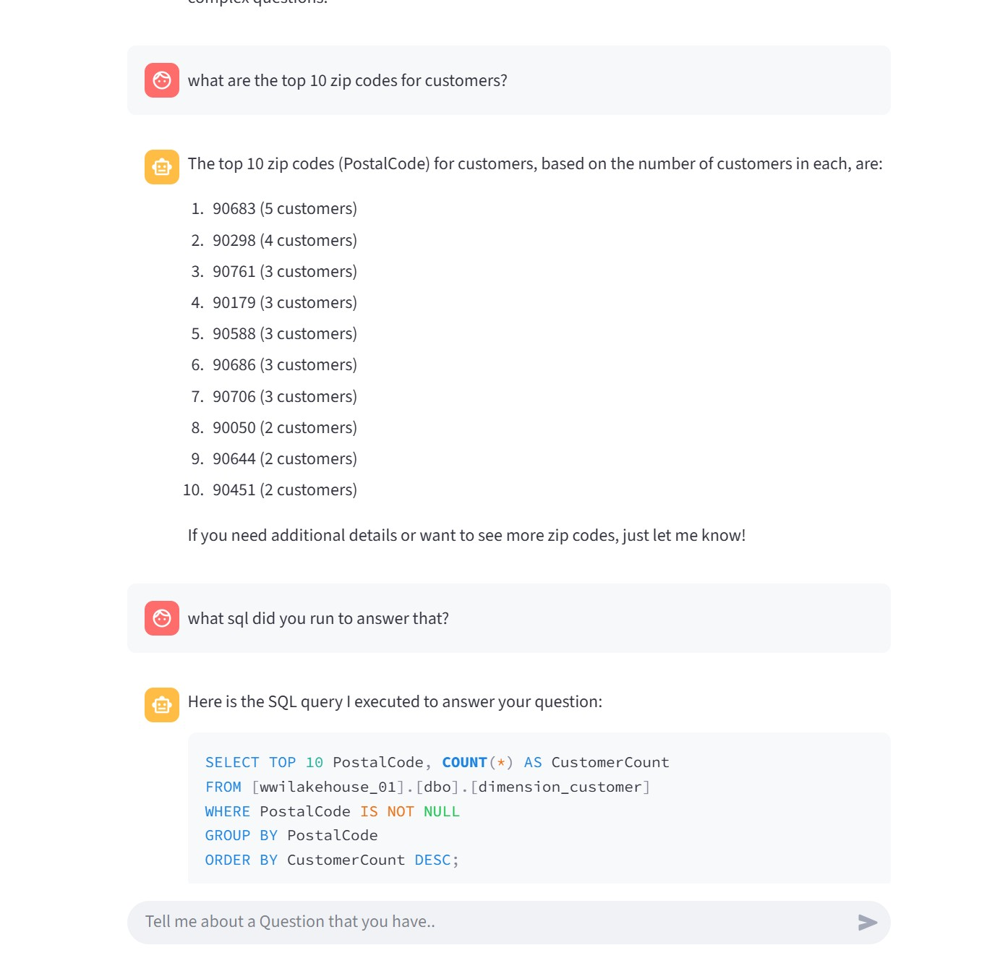

# Fabric Data Agent Exploration

Notebook Break Down:
- 000_AgentDataAgentConnection.ipynb: Creates a data agent that we can get the RUN ID from to provide 
- 001_CallFabricThroughSQL.ipynb: Notebook to call Fabric SQL Endpoint programically, if we can do this, then combine with semantic kerel
- 002_SemanticKernelHelloWorld.ipynb: Notebook to leverage Semantic Kernel in a hello world soft of way.
- 003_SemanticKernelFabricChat.ipynb: Semantic Kerel Add Fabric SQL Plug in and Start Chatting with data.
- 003_SemanticKernelFabricChat.py: streamlit sample web app for chatting on data in Fabric Endpoint: `python -m streamlit run 003_SemanticKernelFabricChat.py`




- 004_AIFoundryAgentWithSQLTool.ipynb: AI Foundry SQL Plugin Tools Agent for chatting on data with a Fabric Endpoint


Sample .env file
```
FABRIC_CONNECTION_STRING=something.datawarehouse.fabric.microsoft.com
FABRIC_WAREHOUSE=nameoffabricwarehouse
FABRIC_TEST_TABLE=sampletesttablename

GLOBAL_LLM_SERVICE="AzureOpenAI"
AZURE_OPENAI_API_KEY="providekeyhere"
AZURE_OPENAI_ENDPOINT="https://resource.openai.azure.com/"
AZURE_OPENAI_CHAT_DEPLOYMENT_NAME="gpt-4.1"
AZURE_OPENAI_TEXT_DEPLOYMENT_NAME="gpt-4.1"
AZURE_OPENAI_EMBEDDING_DEPLOYMENT_NAME="text-embedding-3-large"
AZURE_OPENAI_API_VERSION="2024-12-01-preview"

##Semantic Kernel Settings:
AZURE_AISEARCH_API_KEY=""
AZURE_AISEARCH_URL=""
AZURE_AI_AGENT_NAME = 'AIFoundryAgentWithSQLTool05'
PROJECT_ENDPOINT = "https://resource.services.ai.azure.com/api/projects/projectname"
AZURE_AI_AGENT_DEPLOYMENT_NAME = "AIFoundryAgentWithSQLTool"
AZURE_AI_FABRIC_AGENT_NAME = "AIFoundryDataAgent"
AZURE_FABRIC_CONNECTION_ID = "/subscriptions/XXXXXXXa/resourceGroups/rg-name/providers/Microsoft.CognitiveServices/accounts/foundryresource/projects/project/connections/FabricConnection"
```